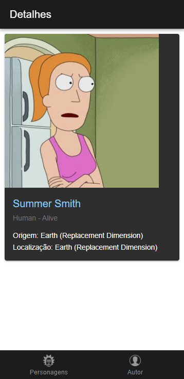

# Explorador de Rick and Morty - Aplicativo Mobile

Aplicativo para explorar o universo de Rick and Morty, desenvolvido para a disciplina de Código de Alta Performance Mobile.

Projeto desenvolvido por **Germária Lins Vilela**.

Repositório: [https://github.com/mafiglv/mobileRickMorty.git](https://github.com/mafiglv/mobileRickMorty.git)

---

## 📋 Descrição do Projeto
Este aplicativo consome a API pública de Rick and Morty para exibir personagens, locais e episódios da série. Desenvolvido com Ionic e Angular Standalone, oferece uma experiência mobile fluida e responsiva.

Tecnologias utilizadas:
- Ionic 7
- Angular 16 (Standalone)
- TypeScript
- API Rick and Morty

---

## 🛠 Funcionalidades Implementadas

- Listagem completa de personagens
- Detalhes individuais de cada personagem
- Navegação por abas intuitiva
- Design responsivo para diferentes telas
- Integração com API pública
- Cache de dados para melhor performance
- Interface com tema escuro
- Transições suaves entre telas

---

## 📱 Telas do Aplicativo

### Tela de Personagens

### Tela de Detalhes

### Tela do Autor

---

## 🚀 Como Executar o Projeto

1. Clone o repositório:
   \`\`\`bash
   git clone https://github.com/mafiglv/mobileRickMorty.git
   cd mobileRickMorty
   \`\`\`

2. Instale as dependências:
   \`\`\`bash
   npm install
   \`\`\`

3. Execute o projeto:
   \`\`\`bash
   ionic serve
   \`\`\`

4. Acesse no navegador:
   \`\`\`
   http://localhost:8100
   \`\`\`

### 📋 Requisitos
- Node.js 16.x ou superior
- npm 8.x ou superior
- Ionic CLI 7.x
- Navegador atualizado (Chrome, Firefox ou Edge recomendados)

---

## 📝 Licença

Este projeto está licenciado sob a Licença Creative Commons Atribuição 4.0 Internacional (CC BY 4.0).

---

## 👩‍💻 Autora

**Germária Lins Vilela**  
- Turma: 4NA  
- Curso: Análise e Desenvolvimento de Sistemas  
- GitHub: [mafiglv](https://github.com/mafiglv)  

---

## 🤝 Como Contribuir

Contribuições são bem-vindas! Siga estes passos:

1. Faça um fork do projeto
2. Crie uma branch para sua feature (\`git checkout -b feature/FeatureIncrivel\`)
3. Commit suas mudanças (\`git commit -m 'Adiciona uma FeatureIncrivel'\`)
4. Push para a branch (\`git push origin feature/FeatureIncrivel\`)
5. Abra um Pull Request

---

## 📚 Documentação Adicional

- [Documentação da API Rick and Morty](https://rickandmortyapi.com/documentation)
- [Documentação do Ionic](https://ionicframework.com/docs)
- [Guia Angular Standalone](https://angular.io/guide/standalone-components)
`;

export default README;
